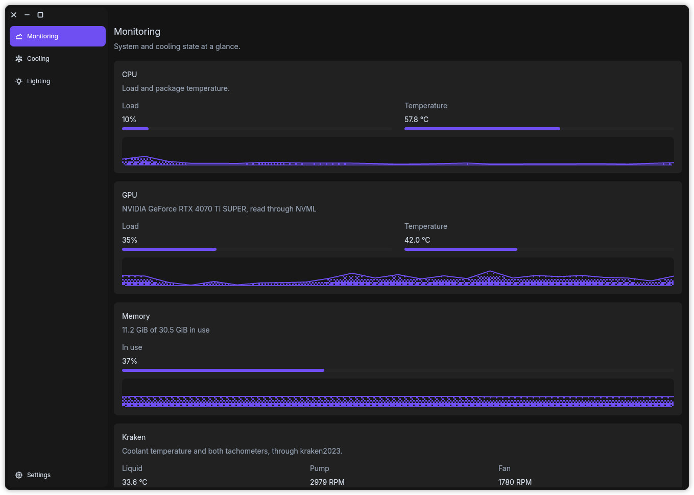
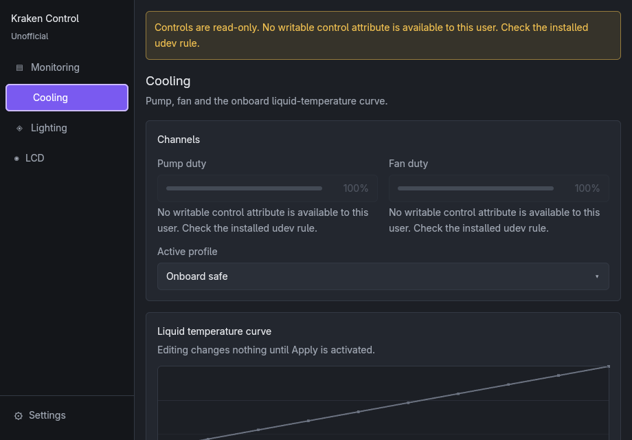
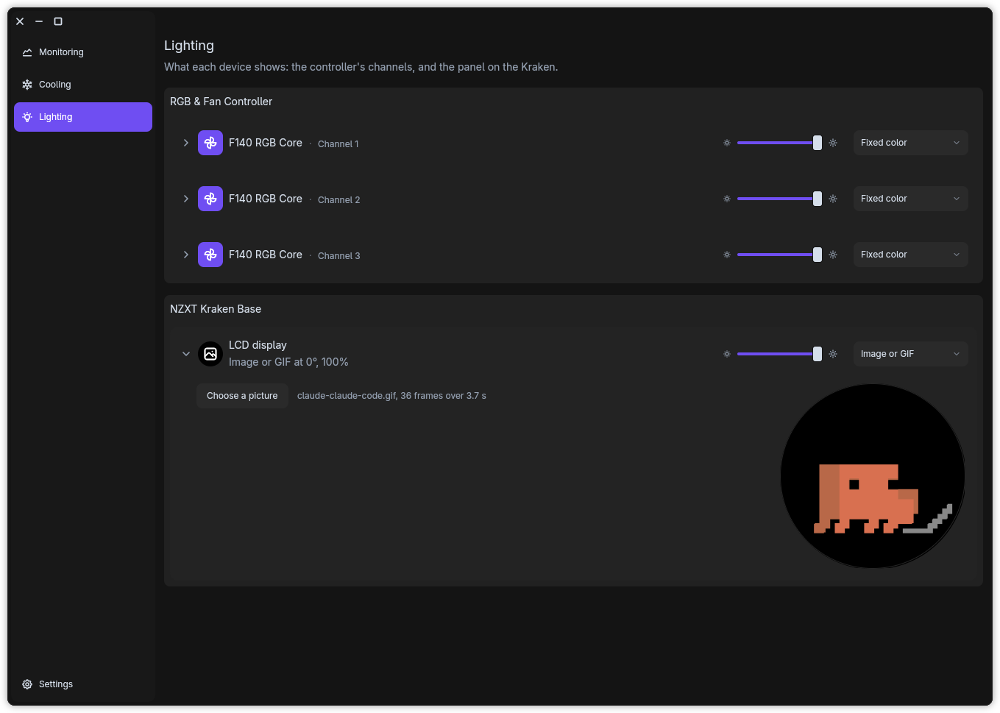

[](https://github.com/arthjean/kori/releases)
[](./LICENSE)

NZXT CAM has no Linux build. Kori is what runs instead.

Kori monitors and controls the NZXT hardware plugged into your Linux desktop: CPU, GPU, memory and Kraken readings, pump and fan duty over the onboard liquid-temperature curve, per-channel RGB, and the Kraken LCD. Native Rust and GPUI, so there is no browser engine and no web UI: 327 ms cold start and 81.3 MiB of anonymous resident memory at idle, on Fedora 44.

A control is driven only where the capability was validated on real hardware at a named firmware revision, and the interface shows you which. Everything else is read, never written.

Everything runs locally: no account, no cloud, no telemetry, zero network requests and zero listening sockets. Neither the interface nor its daemon runs as root.

[Website →](https://kori.arthurjean.com)



## Supported hardware

| Device | VID:PID | Firmware | What Kori drives |
|---|---|---|---|
| NZXT Kraken Base | `1e71:300e` | `0200` | liquid temperature, pump and fan duty, 40 curve points per channel, the LCD |
| NZXT RGB Controller | `1e71:2021` | `0105` | per-channel color and effects |

Any other NZXT device is detected and read. Every write stays disabled with its reason on screen, because support is claimed per device and per firmware, never per product family. A firmware joins that table when a write probe was run on it with an operator watching the hardware, not when a datasheet says it should work.

Your own machine's answer is one command: `korid --capabilities` reads sysfs, opens no socket, and redacts serials. [`docs/capability-record.json`](./docs/capability-record.json) is what it produced here.





## Install

### 1. Install the package

Releases ship x86_64 packages built against glibc 2.35, which covers Ubuntu 22.04, Debian 12, Fedora 37 and anything newer. Grab them from [the releases page](https://github.com/arthjean/kori/releases).

```bash
sudo apt install ./kori_<version>-1_amd64.deb    # Debian, Ubuntu, Mint, Pop!_OS
sudo dnf install ./kori-<version>-1.x86_64.rpm   # Fedora, RHEL, openSUSE, Mageia
```

Arch and everything else: unpack `kori-<version>-x86_64-linux.tar.gz` and run `./install.sh`, which needs no root and installs under `~/.local`. The AUR recipe is written and lives in [`packaging/aur/`](./packaging/aur/), but the package is not published yet, and naming one you cannot install would be worse than offering one route less.

### 2. Join the hardware group

The packages install the udev rule; this decision stays yours because a package cannot make it for you.

```bash
sudo usermod --append --groups kori "$USER"
```

Log out and back in. Group membership is read when the session starts, so a session that predates this line still sees the hardware as read-only.

### 3. Start the daemon

```bash
systemctl --user enable --now korid.service
```

`systemctl --user status korid` reports the socket it bound and how many attributes it found writable on each device. Then launch Kori from your application menu, or run `kori`.

[Building and running from source →](./docs/from-source.md)

## Local by construction

Normal operation opens zero network sockets and makes zero network requests. No account, no cloud, no telemetry, nothing to opt out of.

Neither binary ever runs as root, and `korid` refuses to start as root. Write access comes from [`packaging/udev/70-kori.rules`](./packaging/udev/70-kori.rules), which grants exactly four PWM attributes and eighty curve points on the two allowlisted devices and nothing else. Every reading attribute is world-readable already and is left untouched. Without that rule the application runs read-only and says so, rather than failing silently.

Every release artifact is signed through Sigstore, over a build provenance statement naming the workflow and commit it came from. This project distributes no key and holds none:

```bash
gh attestation verify kori_<version>-1_amd64.deb --repo arthjean/kori
```

## Out of scope

By decision rather than by omission: web integrations, cloud, accounts, telemetry, firmware updates, a remote API, control of hardware this project has not validated, and non-NZXT hardware.

There is no Flatpak and no Snap either. The daemon writes to `hwmon` attributes under `/sys`, which a Flatpak sandbox mounts read-only with no permission that lifts it, so a sandboxed build would install, show telemetry and silently fail every cooling write. [`docs/releasing.md`](./docs/releasing.md) records that and the rest of what a release does.

## Contributing

[Issues welcome!](https://github.com/arthjean/kori/issues) A Kraken this does not cover is worth an issue with your `lsusb -v` output for the device: that is what turns a product family into a validated entry.

[`AGENTS.md`](./AGENTS.md) holds the rules a change has to respect, and [`docs/from-source.md`](./docs/from-source.md) the workspace layout and the validation a story passes.

Unofficial. Not affiliated with or endorsed by NZXT.

GPL-3.0-or-later
